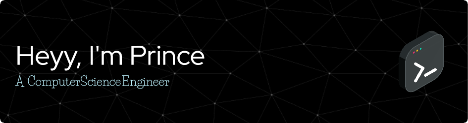



  

  
  

---

### About
I'm **Prince** (aka **HackStyx**) - a Computer Science Engineer who enjoys building clean UIs, reliable backends, and practical developer tooling.

- **Interests**: open source, UI/UX, full-stack web apps, learning new tech
- **Collaboration**: happy to team up on hackathons and projects

### Tech Stack
| Area | Stack |
| --- | --- |
| **Programming Languages** |      |
| **Front-End** |        |
| **Backend & APIs** |        |
| **Cloud & DevOps** |       |
| **Databases & Tools** |          |

### GitHub snapshot

  
  

  

### How I like to work
- **Clarity first**: simple architecture, clear naming, readable commits
- **UX matters**: performance, accessibility, and design polish
- **Reliability**: tests where they pay off, logs where they help

### Highlights
- **Best repos**
  

    
    
  

- **Hackathon projects**
  

    
    
    
  

- **College projects**
  

    
    
  

- If something here helps you, feel free to **fork, star, or open a PR**.

  

